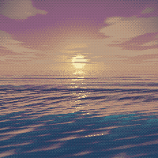

# pixel-sea

Bakes a seamless, pixel-art dusk sea into an animated PNG. There is no
JavaScript, no WebAssembly and no runtime. A page embeds the result with one
`` tag and the browser's image decoder does the rest.

Everything that decides a pixel's colour is Rust. The only dependency is `png`.



The `dusk` theme at 200×200, an 8 second loop at 10 fps on 32 colours, 808 KB.
Baked with:

```bash
pixel-sea --theme dusk --style fine --colors 32 --width 200 --height 200 \
    --seconds 8 --fps 10 --out docs/sea.png
```

Apache-2.0 licence, see [Licence](#licence).

## Install

Needs Rust 1.88 or newer. The code uses `let` chains, which reached stable
Rust in 1.88.

```bash
git clone https://github.com/tidynest/pixel-sea.git
cd pixel-sea
cargo install --path .
```

That puts `pixel-sea` in `~/.cargo/bin`, and `pixel-sea --help` lists every
flag. The examples below use `cargo run --release --` from the clone instead,
which needs no install.

## Usage

```bash
cargo run --release -- --style retro
```

| flag | default | meaning |
|---|---|---|
| `--theme` | `dusk` | which sea. `--list` prints them all |
| `--style` | `retro` | see table below |
| `--still` | off | write one frame instead of a loop |
| `--at` | `0.37` | which moment of the loop a still comes from, 0.0 to 1.0. Implies `--still` |
| `--seconds` | `20` | loop length |
| `--fps` | `12` | frames per second |
| `--width` | style default | pixel width, 16..=4096 |
| `--height` | style default | pixel height, 16..=4096 |
| `--colors` | style default | palette size, 2..=256 |
| `--out` | `sea_<theme>_<style>.png` | output path |

Aspect ratio is free. The vertical field of view is fixed, so a square crops
the scene in from the sides and a wide strip opens it out. An 800×200 banner
sees about 63° to each side and still holds up without looking fisheyed.

### Themes

```bash
cargo run --release -- --list
cargo run --release -- --theme ember --style fine
```

| theme | |
|---|---|
| `dusk` | Low sun, violet sky, warm cumulus over deep blue water. |
| `dawn` | Cold light just after sunrise, rippled water, last stars out. |
| `storm` | Grey-green gale. Heavy cover, big steep sea, constant whitecaps. |
| `tropical` | Bright daylight, turquoise shallows, white cumulus on deep blue. |
| `night` | Moon low over black water, silver road, full star field. |
| `ember` | Sun on the horizon through heavy dust. Deep red, near-black sea. |
| `arctic` | Cold low sun on flat calm. Ice-blue water, very wide. |
| `mist` | Cold sea haar. The sun a pale smear, the water gone glassy grey. |
| `noon` | Sun high and hard. Deep blue open ocean under sharp-edged cumulus. |
| `gloaming` | Sun a few minutes gone. Green-blue afterglow, first stars, black water. |
| `trough` | Down in the swell at four metres. Jade water under a low broken deck. |

A theme is **data, not code**, one row in `src/theme.rs` carrying sky ramp,
light, cloud deck, water, and both wave systems. Adding one touches no
rendering code at all, and since the palette is cut from the render itself, a
new theme gets a matching palette for free.

`--still` writes a single frame in about a second, with wave frequencies still
snapped against `--seconds` so it matches the animation. It is the fast way to
judge a theme you are tuning.

`--at` picks which moment of the loop that frame comes from, as a fraction of
`--seconds`. Sky, clouds and sun hold still, so what changes is the wave field
and the glitter, and that changes a lot. Scrub a few values and pick:

```bash
for a in 0.0 0.15 0.3 0.45 0.6 0.75 0.9; do
    cargo run --release -- --theme dusk --at $a --out scrub_$a.png
done
```

`demo/themes.html` shows all eleven in motion once they are baked:

```bash
for t in dusk dawn storm tropical night ember arctic mist noon gloaming trough; do
    cargo run --release -- --theme $t --style fine
done
```

### Styles

| style | buffer | colours | size at 20 s / 12 fps |
|---|---|---|---|
| `retro` | 320×180 | 64 | 4.3 MB |
| `retro16` | 320×180 | 16 | 2.7 MB |
| `chunky` | 320×180 | 24-bit | 16 MB |
| `fine` | 640×360 | 96 | 15 MB |

`chunky` and `fine` exist for comparison. `retro` is the one to ship. Full
colour costs 4× the bytes for a background nobody looks at directly.

**On file size.** Palette count is a minor lever (32 → 3.5 MB, 48 → 3.9 MB,
64 → 4.3 MB); scene detail dominates. Clouds and two crossing wave systems
are simply more information per frame than a bare gradient was. If 4.3 MB is
too much for your page, cut `--seconds` or `--fps` first. Both scale the
file linearly and neither touches a single pixel's quality.

### Comparing them

`demo/compare.html` switches between all four loops in the browser. Bake them
first, since the PNGs are gitignored and on a fresh clone the page is empty:

```bash
for s in retro retro16 chunky fine; do cargo run --release -- --style $s; done
xdg-open demo/compare.html
```

Only the selected panel is displayed and the hidden ones are `loading="lazy"`,
so the browser never decodes four animations at once.

## GitHub avatars and profile READMEs

**A GitHub avatar will not animate.** The upload keeps one frame whatever you
feed it. This is a long-standing open request rather than something a different
format works around, so the 1 MB avatar limit was never the binding
constraint. The format handling is.

**The API cannot set one either.** `PATCH /user` accepts `name`, `email`,
`blog`, `twitter_username`, `company`, `location`, `hireable` and `bio`, and
no avatar endpoint exists anywhere in the users API. The reason given is that
the REST API carries JSON rather than file uploads. A cron-rotated avatar is
therefore not reachable by any route.

Animation *does* work in a profile README (`<user>/<user>`), in repo READMEs,
and in issue and PR comments.

These are the commands that produced the files in `avatar/`, not
illustrations. Open `avatar/index.html` to compare the eleven stills, round and
square, before committing to one.

```bash
# Avatar still, 512 square, about 70 KB against GitHub's 1 MB limit.
# --at defaults to 0.37. GitHub keeps exactly one frame, so scrub a few
# values before settling; a sweep of the eleven themes chose the default every
# time, but a new theme need not.
cargo run --release -- --theme ember --style fine \
    --width 512 --height 512 --still --out avatar/avatar_ember.png

# Profile README: animated square, deliberately under 1 MB.
cargo run --release -- --theme ember --style fine --colors 32 \
    --width 200 --height 200 --seconds 8 --fps 10 \
    --out avatar/anim_ember_sub1mb.png

# Profile README: wide banner.
cargo run --release -- --theme dusk --style fine --colors 48 \
    --width 800 --height 200 --seconds 8 --fps 10 \
    --out avatar/readme_banner.png
```

`avatar/index.html` shows a 512 still per theme and links each one to a 1024
version. Renders are gitignored, so bake both sets first. The 1024 stills take
`--colors 256` rather than the `fine` default of 96:

```bash
for t in dusk dawn storm tropical night ember arctic mist noon gloaming trough; do
    cargo run --release -- --theme $t --style fine \
        --width 512 --height 512 --still --out avatar/avatar_$t.png
    cargo run --release -- --theme $t --style fine --colors 256 \
        --width 1024 --height 1024 --still --out avatar/hi_$t.png
done
```

Size scales as `pixels × frames × ~0.26 bytes`, which is the number to budget
against, though the spread is real and the scene moves it further than the
palette does. Palette size runs 0.20 B/px at 16 colours to 0.33 at 64, and
large stills run leaner still, but `gloaming` lands at 0.179 on 96 colours,
under the floor of that range at four times the entries. Compose for the
circle. GitHub crops avatars round, so keep the sun and its reflection near
the centre line.

## Embedding

```html

```

```css
.sea-bg {
  position: fixed; inset: 0; z-index: -1;
  width: 100%; height: 100%;
  object-fit: cover;
  image-rendering: pixelated;
}
@media (prefers-reduced-motion: reduce) { .sea-bg { display: none; } }
```

`alt=""` marks it decorative so screen readers skip it. The reduced-motion rule
drops to a static CSS gradient; on a full-screen animated background that is
not optional. See `demo/index.html`.

## Data flow

One frame, start to finish:

```
theme.rs                      sky, light, clouds, water, two wave systems
  -> snap()         sea.rs    builds the wave field, every temporal frequency
                              forced onto a harmonic of the loop
  -> render()       sea.rs    per row: distance + pixel footprint
                              per pixel: wave sum -> normal -> reflect the
                                         view -> sky_radiance() along it,
                                         Fresnel against the water body,
                                         subsurface glow, whitecaps, haze
  -> to_display()   sea.rs    Reinhard tone map, then gamma
  -> median_cut()   palette.rs  palette derived from the render itself
  -> quantise       palette.rs  ordered dither, then nearest palette index
  -> APNG frame     main.rs   indexed PNG, NoFilter, one byte per pixel
```

Two invariants hold this together:

**Seamlessness.** A wave returns to its start after `2π/ω`. `snap()` forces
every `ω` onto an integer multiple of `2π/loop_secs`, so at `loop_secs` the
entire surface is back where it began and the last frame joins the first with
no crossfade. A longer loop gives a finer harmonic grid. At 12 s the three
longest swells collapse onto one shared frequency and visibly beat together.
At 20 s they separate.

**Quantisation is last.** The sea is simulated and lit in full float; only the
final step crushes it to a palette. Simulation and visual style stay
independent, so a new palette never touches a wave. The palette itself is cut
from three sampled frames of the actual render, so it cannot drift out of
sync with the scene the way a hand-written hex table does.

**One sky, used twice.** `sky_radiance()` takes a direction and returns
gradient plus sun plus cloud deck. The sky pixels call it with the view ray;
the water calls it with the *reflected* ray. That is why the clouds appear in
the water, why the glitter path needs no code of its own, and why the horizon
reads as one continuous scene instead of two pictures meeting at a seam.

**Linear light.** All shading is done in linear radiance and tone-mapped once
at the end. Mixing colours in display space is what makes CG gradients go
muddy and highlights go grey, and no amount of palette work recovers from it.

## Tuning

Almost everything now lives in a theme row in `src/theme.rs`:

| knob | effect |
|---|---|
| `swell`, `wind` | the character of the sea, as two wave systems. Keep amp/wavelength under about 1/14 or you have described a wave too steep to stand up. Give the two systems a wide crossing angle, since near-parallel components stripe into corduroy no matter how many you stack. |
| `time_scale` | global brake. 1.0 is physical, lower reads calmer. The only speed knob: wave speed itself follows from wavelength by deep-water dispersion. |
| `eye_h` | eye height in metres. Higher sees further, so waves subtend less and the sea reads vaster and calmer. It also steepens the view angle on near water, which is what lets honest Fresnel work. |
| `light.ang_r` | angular radius of the sun. Disc, aureole and glitter grain all scale from it. Deliberately several times life-size; the true disc would be under a pixel. |
| `light.intensity` | linear radiance before extinction. The tone map turns the core white whatever you set; the drama lives in `aureole`. |
| `light.elev` | sun height. Also feeds `extinction()`, so lowering it reddens and dims the light everywhere at once. |
| `light.airmass_k` | per-channel extinction. A wide spread reddens the light (`ember`); a flat set greys it (`storm`). |
| `clouds.scale` | lobe size, where lower is bigger. `lo`/`hi` set coverage and edge hardness: narrow for cumulus, wide for stratus. |
| `sky.stars` | fraction of sky pixels carrying a star. 0 for anything daylit. |
| `water.foam_k` | whitecap abundance. Storms break constantly; a glassy dawn does not. |

Two knobs remain global, in `sea.rs`:

| knob | effect |
|---|---|
| `SPARKLE_HZ` | how often the sparkle pattern re-rolls. Must divide evenly into the loop. |
| `--colors` | palette size, 2..=256. Dither strength derives from it. |

## Tests and CI

```bash
cargo fmt && cargo clippy --all-targets -- -D warnings && cargo test
```

Five tests. The load-bearing one is `every_frequency_is_a_loop_harmonic`. If
a wave is added and `snap()` is bypassed, the loop gets a visible jolt once per
cycle, and that test fails instead of the artefact shipping.

`palette_output_stays_on_palette` also asserts the render uses a *spread* of
the palette, which is what catches a flat or collapsed scene automatically.

`.github/workflows/ci.yml` runs six stages on every push to `main` and every
pull request, in this order: fmt, audit, deny, check, clippy, test. The two
security stages come before anything compiles, so a fresh advisory stops the
run in seconds rather than after a build. It then bakes one still, because the renders are
gitignored and nothing else in the suite proves the binary can write a file.
The advisory stages also run weekly on a schedule, since the advisory database
moves even when this repo does not.

## Why an animated PNG and not GIF or wasm

GIF caps at 256 colours per frame, so the `chunky` full-colour comparison
cannot exist in it. WebAssembly cannot boot in a browser without JavaScript,
because `WebAssembly.instantiate` is itself a JS API, so a live simulation was
off the table under a zero-JS constraint. Baking flips the cost model anyway:
the render is paid once, here, so the sim can afford seven waves and expensive
per-pixel lighting that a live loop could never ship.

The sun's colour is not picked, it is derived: `extinction()` computes how
much red, green and blue survive the airmass at the sun's elevation. Lower
the sun and the light reddens everywhere at once, across disc, aureole,
glitter and the warm light on the crests, because all four read that number.

PNG filters predict each byte from its neighbours. On dithered RGB the
neighbours are deliberately uncorrelated, so filtering *adds* entropy. The
first working build was 14 MB. Writing palette **indices** with `NoFilter`
instead lets deflate exploit the Bayer pattern's 4-pixel period: same pixels,
15× smaller.

## Licence

Apache-2.0. Full text in `LICENSE`. Every dependency in the graph is MIT or
Apache-2.0, so nothing in the tree conflicts with it. `deny.toml` enforces
that in CI.
